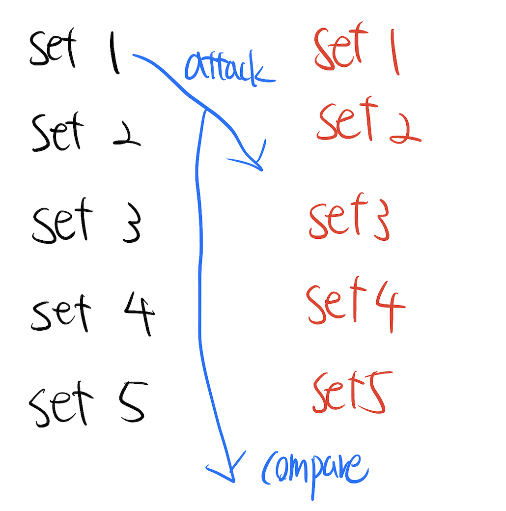

# Warwick Hackathon
Team members: 
  1. Cheng-Han Yang (Henry) Intermediate Discord: Salmon#8606
  2. Yaxin Luo (Alex) Beginner Discord: Yaxin_Luo#3942

Introduction: We used Python to make a simple poker card game. This game is for two people. There are 52 poker cards and they are distrubited to two parts. Player 1 gets clubs and spades while player 2 gets diamonds and hearts. In a game, there are 5 rounds. Each user has use their 26 cards to combine 5 sets, and there are 5 cards in a set, which means there will be one card left. \

There are 6 types of sets and more above, more bigger:
1. biggest straight flush
2. straight flush
3. same colour
4. straight
5. two pairs
6. one pair

Each player can not make the same kind of set among 5 sets. In the first round, player 1 attack first, then alternate in next three rounds. In a round, the person who attack can choose one card to be exposed. Then choose one set to attack a set of the other player. If the set from attacker is bigger then score of attacker will plus one, otherwise it is smaller the other player score plus one. In the final round(5th round), both the last set left have to compare to each other. 

Code representation:
  1. Player 1: the format of each card is like this: sign, number. In the first number, 0 indicates clubs and 1 indicates spades. For example: 0 3 this means 3 in club.
  1. Player 2: the format of each card is like this: sign, number. In the first number, 0 indicates diamonds and 1 indicates hearts. For example: 1 7 means 7 in heart.

Rules:
1. In the beginning, player 1 enter five sets first steps by steps, and then player 2.
1. In the first round, player 1 choose which card to be unveil, and choose which set to attack and choose one of opponet set to be attacked.
1. In the second, it is player 2 turn to attack. In the 3rd and 4th round, it is just the same. In the final round, both set from both player will attack to each other automatically. 
1. In the end, the person who get more score is winner, otherwise it is tie. 
